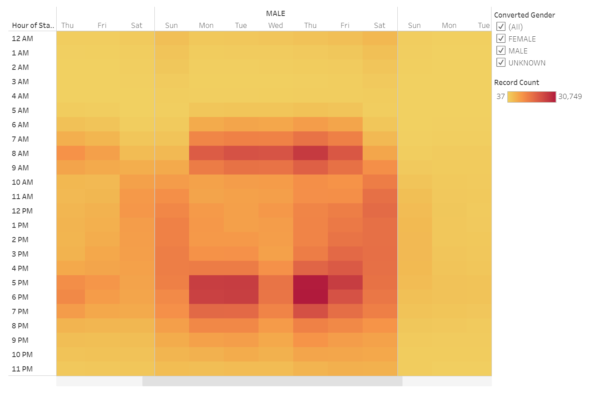

# Citi Bike Analysis
## Project Overview
In the following project, we analyzed Citi Bike data to determine the viability of expanding the service to different metropolitan areas. Citi Bike is a bike-sharing system in New York City with over a thousand docking stations where subscribers and casual users can access the vast network of available bikes through the Citi Bike app to get around the bustling metropolis. It provides users a convenient and reliable way to explore the city or even improve their commutes. The service also has many benefits to the city, such as reducing congestion and emissions. Citibike is a revolutionary service that has the potential to improve the transportation networks of cities across the nation. We will be using Tableau to understand how Citi Bike is used to optimize the service. Our analysis will provide us with insights to extrapolate to other metropolitan areas in the United States. 
## Resources
- Tableau Public 2021.1
- Python 3.7.6
## Results
[link to dashboard](https://public.tableau.com/app/profile/josue.lemus/viz/CitiBikeChallenge_16228456749710/Story1)
### Viz 1

  

Our first visualization displays the top starting and ending locations for the bike trip data. Manhattan has to most activity out of all the boroughs of New York City. The records are the most concentrated in mid and lower Manhattan. Further analysis indicates that the Pershing Square North docking station is the most popular destination for starting and ending a trip. To the southwest, we have Brooklyn, which has a considerable amount of activity as well. Docking station records appear to taper off in Queens, and there are virtually no records in the Bronx or Staten Island. 

### Viz 2

  

If we look at the most popular hours to initialize a trip, we can conclude that the most popular hours to start a journey are around 8 am and 5 pm.  

### Viz 3

  

We can dissect the most popular hours to start a trip even further by creating a stacked bar chart. Those who use Citi Bike throughout the day are more likely to be either male or subscriber.

### Viz 4

  

Knowing that the most popular hours to start a trip are around 8 am and 5 pm, we created a visualization that shows which days of the week are getting the most activity. Weekday mornings and evenings have the most bike records. It appears that many people are using the Citi Bikes for their daily commutes to work since the hours between 8 am - 5 pm have considerably less activity.

### Viz 5

  

Using the visualization that shows the most active times for each day of the week, we created a visualization that shows how gender plays a role. For example, men appear to use Citi Bikes heavily on Thursday around 6 pm.

### Viz 6

  

The nature of bike trips appears to be quick for Citi Bike users. The majority of trips last around 5 minutes, regardless of gender. Furthermore, Citi Bike usage drops below 1000 records after one hour. 

### Viz 7

  

The visualization above summarizes our findings of the nature of trips and the type of user. Male subscribers appear to be the most active users of Citi Bikes. 

## Summary
After visualizing the data, it appears the Citi Bikes are used the most for quick commutes to and from work. Those trips that last longer than an hour are presumably being utilized for leisure activity. The Citi Bikes also have a loyal following with over 80 percent of users being a subscriber. Manhattan, specifically the Pershing Square North docking station, is the most popular location to start and end a trip. Pershing Square is a public square that appears to be a very pedestrian-friendly area. Public Squares should be used as the ideal location for docking stations wherever Citi Bike decides to expand. It would also be wise to place docking stations near popular destinations for sightseeing.

Citi Bike could benefit from using other forms of visualizations to improve its services. For example, Citi Bike could visualize which bikes have the least activity. By doing so, they can rotate the bikes with the least amount of activity to areas with high activity, such as Pershing Square. Alternating overused bikes with those that are not used as often could potentially reduce maintenance costs and the likelihood that a bike will break during a trip. Visualizing popular user-type destinations could also aid in improving the user's experience. For example, where are popular starting points for subscribers? Knowing this information can assist in determining how many docking stations need to be placed in those locations, thus improving reliability. Reliable service will be how Citi Bike increases and maintains user subscriptions. 
